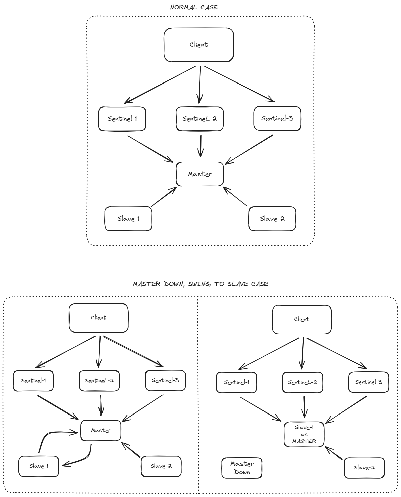

# Redis-Sentinel Docker-Compose

An example setup for using Redis Sentinel with Docker Compose.

For more information and an explanation, see: https://www.developers-notebook.com/development/using-redis-sentinel-with-docker-compose/

# Topology



# Redis UI

Dashboard can be accessed by the follow url
- http://localhost:7843/

After accessing the page go to connect -> sentinels-setup configuration


# Redis Master

```
export REDIS_MASTER_IP=10.10.1.23     # IP Docker host from Master server
```

Command to deploy master

```
docker compose -f docker-compose.master.yml up
```

# Redis Slave

```
export REDIS_MASTER_IP=10.10.1.23     # IP Master server, for setup slaveof
export SENTINEL_IP=10.10.1.23         # IP Docker host from Slave server, for announce-ip
```

Command to deploy slave

```
docker compose -f docker-compose.slave.yml up
```